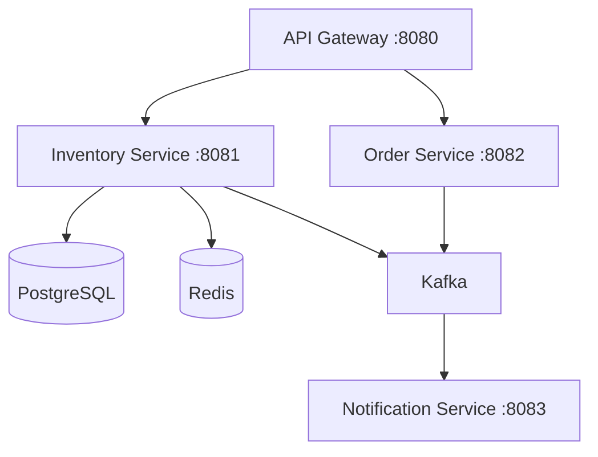

# Distributed Inventory System

This project is a **microservices-based backend system** for warehouse inventory management, built to practice event-driven architecture, caching and containerization

---

## Architecture



## Tech Stack

- **Spring Boot 3** - Core framework for each microservice
- **Spring Cloud Gateway** - API Gateway & routing
- **Apache Kafka** - Async event-driven communication between services
- **Redis** - Caching product/stock lookups
- **PostgreSQL** - Persistent relational storage
- **Docker Compose** - Local orchestration, one command starts everything up
- **Lombok** - Reduces Java boilerplate

---

## Why this project

I built this to practice microservice architecture, specifically event-driven communication with Kafka and caching strategies with Redis, since most of the experience previous to this project has been with monolitic Spring Boot apps.

## Getting Started

### Requirements
- Docker Desktop

### Run

```bash
git clone https://github.com/ChapaRacer/distributed-inventory-system.git
cd distributed-inventory-system
docker compose up --build
```

When you see this the system is ready:

```bash
warehouse-api-gateway | Started ApiGatewayApplication
```

---

### Endpoints (via API Gateway :8080)

GET /api/products -> List all products \
POST /api/products -> Create product \
GET /api/products/{id} -> Get product (Redis cached) \
PUT /api/products/{id}/stock -> Update stock level \
DELETE /api/products/{id} -> Delete product

POST /api/orders -> Place and order \
GET /api/orders/{id} -> Get order status \
PUT /api/orders/{id}/cancel -> Cancel an order

## Kafka Event Flow

order-service -> [order.placed] -> inventory-service \
order-service -> [order.placed] -> notification-service \
order-service -> [order.cancelled] -> inventory-service \
inventory-service -> [inventory.stock.updated] -> notification-service \
inventory-service -> [inventory.low.stock] -> notification-service

## Project Structure

distributed-inventory-system/ \
├── docker-compose.yml \
├── docker/init.sql \
├── shared-lib/ \
├── api-gateway/ \
├── inventory-service/ \
├── order-service/ \
└── notification-service/