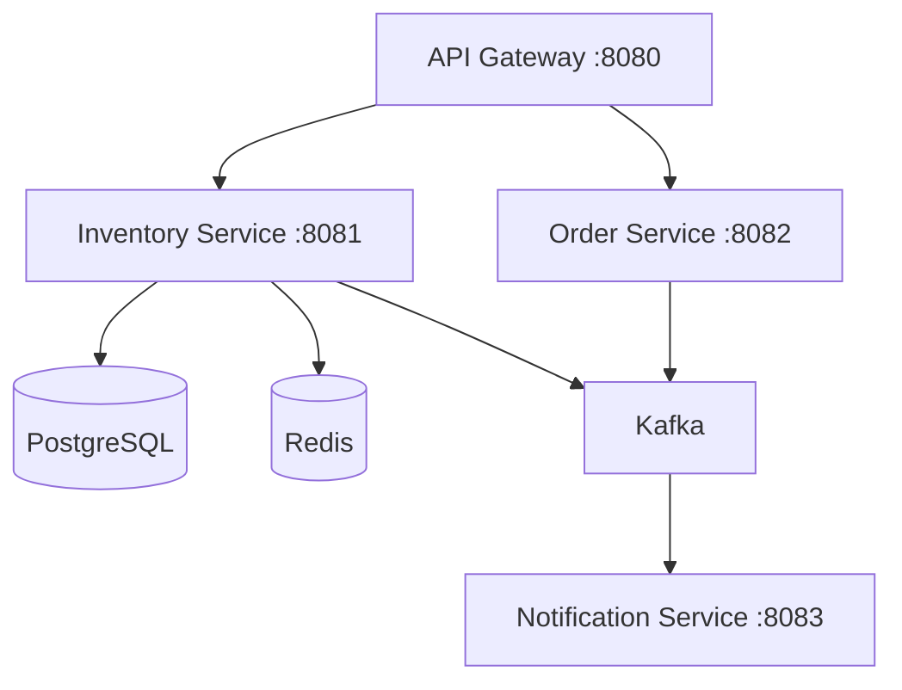

# Distributed Inventory System

This project is a **microservices-based backend system** for warehouse inventory management, built to practice event-driven architecture, caching and containerization

---

## Planned Architecture

## Planned Tech Stack

- **Spring Boot 3** - Core framework for each microservice
- **Spring Cloud Gateway** - API Gateway & routing
- **Apache Kafka** - Async event-driven communication between services
- **Redis** - Caching product/stock lookups
- **PostgreSQL** - Persistent relational storage
- **Docker Compose** - Local orchestration, one command starts everything up
- **Lombok** - Reduces Java boilerplate

---

## Status

Work in progress. Currently setting up the project structure

## Why this project

I'm building this to practice microservice architecture, specifically event-driven communication with Kafka and caching strategies with Redis, since most of the experience previous to this project has been with monolitic Spring Boot apps.